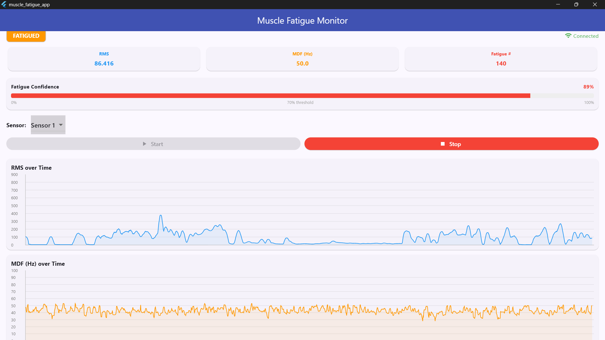
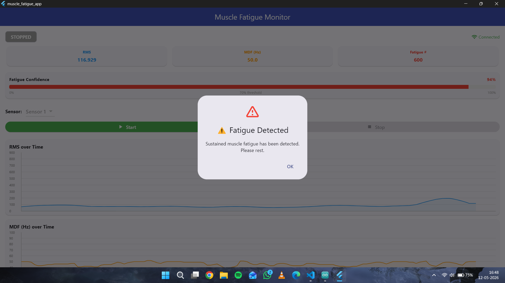
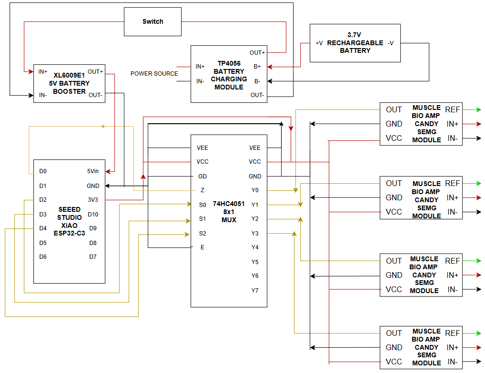

# SPASMENDER

SPASMENDER is a real-time surface electromyography (sEMG) data processing and muscle fatigue prediction pipeline. By recording electrical muscle activity via sEMG electrodes connected to an ESP32 micro-controller, the system extracts key time and frequency domain features to train a Support Vector Machine (SVM) classifier.

Once trained, a live Flask-based backend receives real-time streaming data over Wi-Fi, computes features on the fly, and outputs whether the user is experiencing muscle fatigue alongside a confidence score (probability). This tool offers profound utility in clinical and medical settings, enabling clinicians and patients to benchmark and track self-reported muscle fatigue against empirical, predictive physiological metrics over time.

---

##Repository Structure & Pipeline Workflow

The project is cleanly divided into data generation, model training, and live deployment modules located under the `candy_read` directory:

```
📦 spasmender
 ┗ 📂 candy_read
   ┣ 📂 read_data_to_make_dataset
   ┃ ┣ 📜 read.ipynb                  # 1. Raw Data Ingestion
   ┃ ┣ 📜 csv_label_creater.ipynb     # 2. Data Labeling & Segmentation
   ┃ ┗ 📜 feature_extract.ipynb       # 3. Feature Extraction Engine
   ┣ 📂 model_train
   ┃ ┗ 📜 train_model_svm.ipynb       # 4. SVM Model Training
   ┗ 📂 Flask
     ┗ 📜 test_candy_flask_wifi_model.py # 5. Live Inference Backend (Flask)

```

### 1. Data Ingestion & Preprocessing (`read_data_to_make_dataset/read.ipynb`)

Handles initial communications to stream raw data from the ESP32. It records both the raw high-frequency sEMG signal and the envelope sEMG values, logging them securely to form the structural base of the raw dataset.

### 2. Annotation & Splitting (`read_data_to_make_dataset/csv_label_creater.ipynb`)

Segments the ingested time-series recordings into distinct states. It produces two distinct `.csv` files: one holding data corresponding to a baseline, non-fatigued state, and another mapping out the active progression into muscle fatigue.

### 3. Feature Extraction Engine (`read_data_to_make_dataset/feature_extract.ipynb`)

Processes both raw and envelope data within predefined mathematical windows (200 samples) to compute time-domain and frequency-domain characteristics. It combines these classes into a singular unified `.csv` file prepared for ML mapping.

### 4. Classifier Development (`model_train/train_model_svm.ipynb`)

Imports the extracted features dataset, performs uniform feature scaling using `StandardScaler`, and trains a Support Vector Machine (SVM) with a Radial Basis Function (RBF) kernel. The trained pipeline object is serialized and saved as a `.pkl` model file.

### 5. Live Inference Engine (`Flask/test_candy_flask_wifi_model.py`)

A lightweight Flask backend designed for low-latency operational environments. It sets up a network listener to ingest real-time data packets from the ESP32 over Wi-Fi, passes incoming windows through the `.pkl` model matrix, and yields instantaneous fatigue classifications along with an associated probability score.

---

##  Feature Extraction Blueprint

The system extracts five core features across each sliding window of data. Because these features map entirely distinct physical dimensions—ranging from pure counts to raw frequencies—feature scaling via `StandardScaler` is explicitly embedded in the ML pipeline to prevent feature domination.

### Feature Matrix & Explanations

#### **Root Mean Square (RMS)**

* **Target Signal:** Envelope
* **Mathematical Concept:** Measures the power of the active signal.

$$\text{RMS} = \sqrt{\frac{1}{N}\sum_{i=1}^{N} x_i^2}$$


* **Unit & Range:** **ADC counts** (Typically `0 — 700`). Maps directly to the ESP32's 12-bit analog-to-digital converter ($0 - 4095$).
* *Note: To map this to absolute physical scale, multiply by $\approx 0.806\text{ mV/count}$ ($3300\text{ mV} / 4095$), though raw counts are preserved during modeling.*

#### **Mean Absolute Value (MAV)**

* **Target Signal:** Envelope
* **Mathematical Concept:** Evaluates average amplitude; structurally tracks closely with RMS but minimizes the weighting impact of extreme isolated outliers.

$$\text{MAV} = \frac{1}{N}\sum_{i=1}^{N} |x_i|$$


* **Unit & Range:** **ADC counts** (Typically `0 — 600`).

#### **Median Frequency (MDF)**

* **Target Signal:** Raw Signal
* **Mathematical Concept:** Calculated by executing Welch’s periodogram method to determine the Power Spectral Density (PSD). MDF points to the exact frequency threshold that divides the total power spectrum into two equal halves. As muscles tire, action potential conduction velocities slow down, causing an observable downward shift in MDF.
* **Unit & Range:** **Hz** (Typically `39 — 60 Hz`). Stronger, rested contractions default toward the higher end ($60\text{ Hz}$), dropping significantly down toward the floor ($39\text{ Hz}$) under physiological fatigue conditions.

#### **Zero Crossing Rate (ZCR)**

* **Target Signal:** Raw Signal
* **Mathematical Concept:** Counts the number of times the raw fluctuating waveform passes through zero, mapping high-frequency geometric changes.
* **Unit & Range:** **Count / Dimensionless** (Typically `15 — 90` inside a 200-sample window).

#### **Waveform Length (WL)**

* **Target Signal:** Raw Signal
* **Mathematical Concept:** The cumulative length of the waveform over the window, capturing complexity, amplitude, and frequency dynamics simultaneously.

$$\text{WL} = \sum_{i=1}^{N-1} |x_{i+1} - x_i|$$


* **Unit & Range:** **ADC counts** (Typically `5,000 — 75,000`). Because the accumulation scales values significantly higher than other parameters, standardization is absolutely mandatory before modeling.

### Summary Metrics Reference Table

| Feature | Computed On | Mathematical Unit | Typical Setup Range |
| --- | --- | --- | --- |
| **RMS** | Envelope | ADC counts | 0 — 700 |
| **MAV** | Envelope | ADC counts | 0 — 600 |
| **MDF** | Raw Signal | Hz (Hertz) | 39 — 60 |
| **ZCR** | Raw Signal | Count (Dimensionless) | 15 — 90 |
| **WL** | Raw Signal | ADC counts | 5,000 — 75,000 |

---

## Why Support Vector Machines (SVM)?

The selection of a Support Vector Machine over alternative models (such as Deep Learning architectures or Neural Networks) is guided by the specific nature of sEMG signal tracking:

* **Optimized for Small Datasets:** sEMG diagnostic records naturally yield smaller, concise data pools instead of millions of sample blocks. SVMs operate by optimizing the maximum-margin boundary using support vectors, preventing over-fitting where neural networks would typically fail.
* **Non-Linear Adaptability (RBF Kernel):** Fatigued vs. Non-fatigued boundary clusters are not linearly separable within a 5-dimensional coordinate map. Utilizing a Radial Basis Function (RBF) kernel projects features implicitly into high-dimensional space where boundaries can be smoothly mapped.
* **Deterministic, Low-Latency Performance:** Real-time feedback loops demand execution routines that finish in microseconds. SVM inference leverages simple vector multiplication, fitting perfectly inside a 100ms real-time Flask framework window without relying on hardware accelerators (GPUs).
* **Class Imbalance Mitigation:** Physical data capturing inherently logs significantly longer stretches of non-fatigued activity prior to reaching exhaustion points. Implementing `class_weight="balanced"` lets the algorithm automatically balance minority classification penalties.

---

## 🛠️ Setup and Installation

### Prerequisites

Ensure your local machine has Python 3.8+ installed.

### Dependency Configuration

Clone this repository and install the required modules directly:

```bash
git clone https://github.com/ATHUL-K-A/spasmender.git
cd spasmender
pip install numpy scipy pandas scikit-learn flask

```

### Execution Steps

1. **Collect Base Data:** Run through `candy_read/read_data_to_make_dataset/read.ipynb` with your ESP32 broadcasting over the local network layer to map sEMG arrays.
2. **Establish Labels:** Execute `candy_read/read_data_to_make_dataset/csv_label_creater.ipynb` to explicitly mention the fatigue and non fatigue datasets
3. **Create Features:** Run `candy_read/read_data_to_make_dataset/feature_extract.ipynb` to extract features such as mav,zcr,wl in addition to rms and mdf to a new dataset
4. **Train Model:** Execute `candy_read/model_train/train_model_svm.ipynb` to evaluate the data and train a model using svm (`model.pkl`).
5. **Launch Flask** Deploy your live listener infrastructure:
```bash
cd candy_read/Flask
python test_candy_flask_wifi_model.py

```


---

### Flutter Application Summary

The **SPASMENDER Flutter App** serves as the user-facing dashboard for the muscle fatigue monitoring system. Built using **Material 3** guidelines with a clean, responsive layout, its primary role is to provide real-time visual biometrics and controls to the user or clinician.





#### Core Capabilities:

* **Low-Latency Streaming:** Utilizing `socket_io_client`, the app establishes a persistent WebSocket connection directly to the Flask backend, parsing and rendering automated state updates approximately every 100ms.
* **Dynamic Data Visualization:** Using the `fl_chart` library, the application plots continuous trends for both **Root Mean Square (RMS)** and **Median Frequency (MDF)** over a rolling time window, allowing users to visually spot the physiological shifts that occur as muscles tire.
* **Smart Alerting:** The app features a dynamic **SVM Confidence Bar** that shifts colors (Green $\rightarrow$ Orange $\rightarrow$ Red) based on live machine learning probability scores. If sustained muscle fatigue is identified, the app triggers an immediate, unmissable `AlertDialog` to halt the session safely.
* **Hardware & Session Control:** Through integrated REST HTTP calls (`GET` requests), users can instantly toggle the physical hardware's multiplexer channel selection via a dropdown menu, as well as initiate or terminate active sensor polling streams.

---


